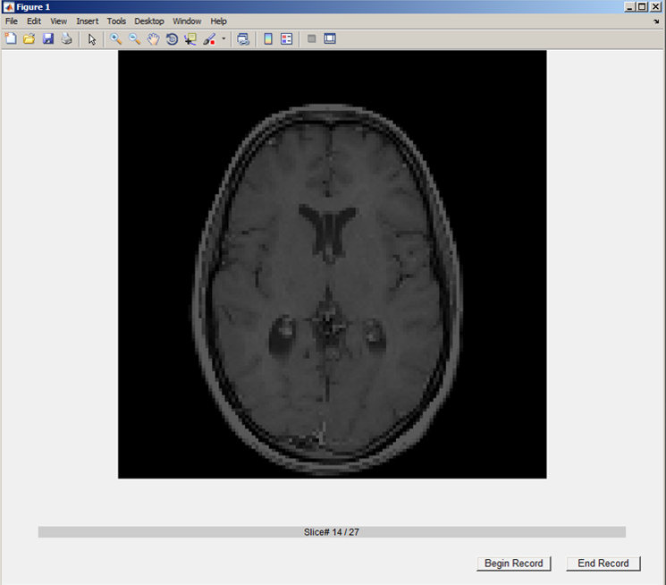

# Eye Tracking System Project

## Goal

To create a prototype system that can monitor and record radiologists’ eye movements when they are examining medical images, and to design a set of visualization tools to present the eye gaze data collected after the examination. 

## Scope

Ultimate Goal: reduce diagnostic errors and improve diagnosis efficiency in radiology

Stage 1: design a research tool, based on eye tracking technology, that will collect, record and display eye gaze data of participating radiologists, in order to obtain the regions radiologists have examined, as well as their search patterns.

Stage 2: understanding of the search patterns, based on data collected from first stage

Stage 3: create a clinical tool that could support diagnosis work of radiologists, by recording the regions examined, flagging missed regions, and prompting to double check in real time

## Hardware Used

Gazepoint GP3

## Software UI
#### Main GUI

#### Image Displaying Page

#### Visualization Page

